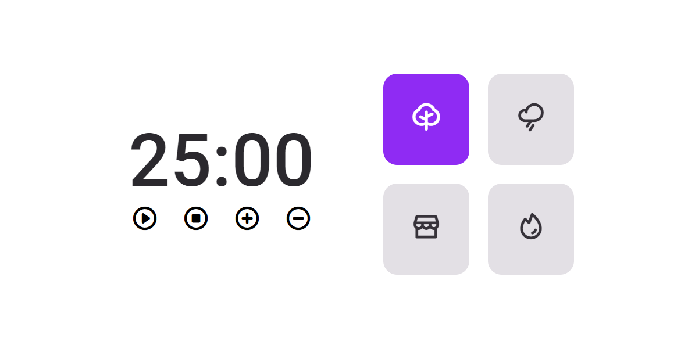

# Desafio Prático Explorer

## Acesso

[Clique aqui](https://github.com/Busolin/FocusTimer)

## Descrição do Projeto

Focus Timer é uma aplicação web que ajuda você a gerenciar seu tempo de foco e pausas, utilizando sons para notificações.

## Status do Projeto

Concluído ✅

## 🛠 Tecnologias

As seguintes ferramentas foram usadas na construção do projeto:

- HTML
- CSS
- JavaScript
- Git e GitHub

## Aprendizados
Desenvolver um aplicativo de Pomodoro utilizando JavaScript proporcionou valiosos aprendizados sobre controle de tempo e gestão de estado no front-end. Ao trabalhar com temporizadores, aprimorei minhas habilidades em manipulação de datas e intervalos no JavaScript. A implementação de uma interface dinâmica reforçou minha compreensão sobre manipulação do DOM e criação de eventos personalizados. Esse projeto também me ajudou a entender melhor os conceitos de modularidade e reutilização de código, permitindo a construção de uma aplicação limpa e escalável.